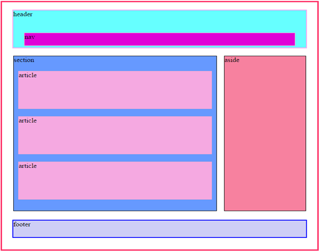
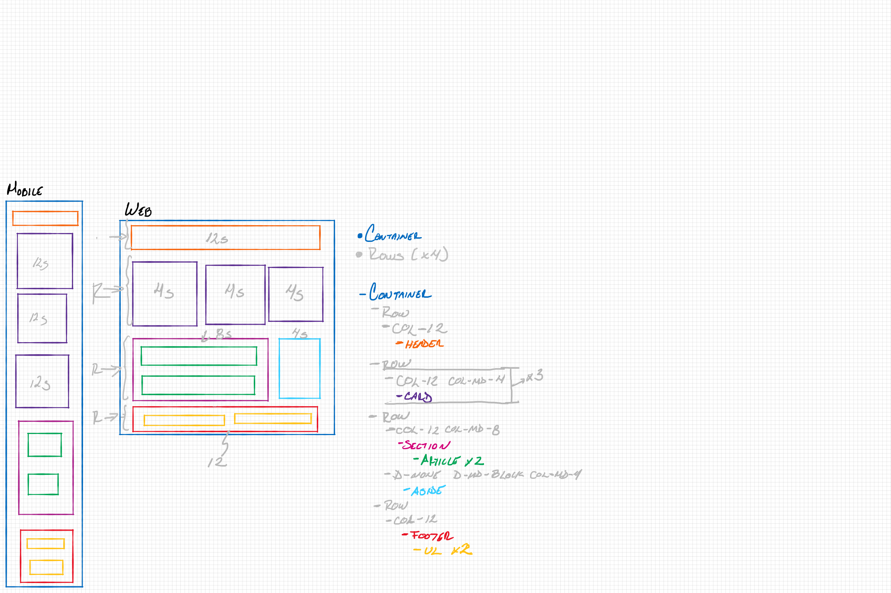

# Maquetado

## Practice #1
### Fecha: Miercoles 19 de Febrero
- Crear el HTML correspondiente a la imagen que les acabo de compartir. El html debe contener todos los tags necesarios para crear la estructura mostrada, con las respectivas anidaciones y textos indicando el nombre de la sección ( así como se muestra en la imagen )
esa es la práctica fundamental, de manera adicional, pueden investigar como funciona el atributo style y con el modificar los tamaños, 
colores de fondo, proporciones, etc y al terminar, por favor súbanlo a su repositorio

Dado un layout crear el HTML correspondiente con los tags necesarios para la estructura. Ademas agregar los estilos necesarios con el atributo style.



## Practice #2
### Fecha: Jueves 20 de Febrero
- Hay que hacer el layout de la practica #1 utilizando css como un archivo externo

Dado el layout de la practica #1 agregar los estilos por medio de un archivo externo style.css

## Practice #3
### Fecha: Sabado 22 de Febrero
- La práctica consiste en desarrollar los dos diseños (mobile  web)
para ello deben formar equipos de 3, crear un repositorio que se llame responsive_landing
y en él subir los archivos necesarios para crear esta maqueta

Dado un layout desarrollar la maqueta con los diseños (mobile y web). Esto en equipos de 3. Subirlo a un repositorio llamado responsive_landing.


## Practice #4
### Fecha: Lunes 24 de Febrero
- Es la práctica #3, adicional que todos en el grupo colaborariamos en el repo de Isra.

Adicional a la práctica #3 todo el grupo colaboramos para subirlo un solo repositorio.


## Practice #5
### Fecha: Jueves 27 de Febrero
- La práctica consiste en realizar el layout de la practica #1, pero esta vez usando bootstrap
por lo que debería ser responsivo, para la versión móvil necesitamos que todo se apile debajo de la sección anterior, es decir, debe quedar:
    - Header
    - section
    - aside
    - footer

esto lo deben de lograr con el menor css posible

Dado el layout de la práctica #1, implementar los estilos con Bootstrap y además que sea responsivo.


## Practice #6
### Fecha: Jueves 27 de Febrero
- Dado el analisis de un layout con bootstrap Maquetarlo.

Dado el analisis de un layout estilarlo con Bootstrap.



## Practice #7
### Fecha: Viernes 28 de Febrero
- Realizar el maquetado de una landing page en equipos de 3 implementado.
    - Bootstrap
    - scss

Dado el diseño de una landing page. Realizar el maquetado implementando Bootstrap y scss. En equipos de 3.


## Practice #8 - Taller-Maquetado
- Realizar el maquetado de una landing Page - Taller


# JavaScript

## Practice #1
1. Crear las variables x, y
2. asignarles un valor numérico
3. imprimir la suma de x + y
4. imprimir la resta de x - y
5. imprimir la multiplicación de x*y
6. division x/y


## Practice #2

- Tener los valores de x, y compararlos
    Si x es mayor que y, mostrar un mensaje que lo indique
    si x es menor que y, mostar un mensaje que lo indique

## Practice #3
- Multiplicar 2 valores y verificar si el resultado de la multiplicacion es par o non
    - si es par, indicarlo con un mensaje
    - se es non, indicarlo con un mensaje

## Practice #4
- Recibir un numero del parte de un usuario y calcular
    el area de un circulo cuyo radio sea igualal numero proporcionado

## Practice #5
- Recibir del usuario los datos de 3 lados de un triangulo
    con base en esos datos, determinar:
    1. El área del triangulo y mostrarla en un mensaje
    2. En otro mensaje, indicar si el triangulo es isoseles, equilátero o escaleno

- Una vez finalizado lo anterior, determinar si el triángulo es un *triángulo rectángulo*

## STRING METHODS
## Practice #1
- Obtener el nombre completo del usuario e indicarle cuantos caracteres tiene su nombre
## Practice #2
- Obtener el nombre completo del usuario y determinar:
    1. cuántos caracteres tiene
    2. si su nombre tiene menos de 15 caracteres, indicarle mediante un mensaje que su nombre es mmuy corto
    si tiene más de 15 caracteres indicarle que su nombre es muy largo
## Practice #3
- obtener el nombre completo del usuario contar cuántas vocales tiene
## Practice #4
- Recibir una palabra del usuario, y formar una nueva palabra usando las dos primeras y las dos últimas letras de esa palabra. Si la palabra tiene menos de 5 caracteres, enviar un mensaje de error al usuario indicándoselo.
## Practice #5
- Solicitar al usuario nombre y edad, y mostar un mensaje que diga "hola, soy {nombre} y tengo {edad} años"
## Practice #6
-  Del texto **"Cada estudiante tiene su ritmo, cada estudiante tiene su talento, y cada estudiante complementa al estudiante que tiene a su lado"**
    Contar cuántas veces se usa la palabra **"estudiante"** y reemplazar todas las coincidencias por la palabra **"Koder"**, y mostrar el mensaje de nuevo al usuario

## ARRAY - FOR - FOREACH

## Practice #1
- Pedir al usuario la cantidad de koders a registar, pedir tantos nombres de koder como el usuario haya indicado y guardar cada nombre de cada koder en una colección además por cada Koder imprimir únicamente el primer nombre.

## FUNCTIONS

## Practice #1
- Iterar dentro del array,
    por cada item, obtener el nombre de cada bmentor
    extraer la primer letra de cada palabra del nombre
    concatenar el contenido de cat item con las iniciales  separadas por un punto mostrar en consola el resultado

    output = Brenda Gonzales B. G.
## Practice #2
- Crear una funcion o funciones que permitan elegir al usuario
    una operacion basica, indicar dos valores y ejecutar la operacion 
    seleccionada. imprimir el resultado

    output: "La ${operacion} de los dos numeros que indicaste es: ${resultado}"

## Practice #3
- Crear una función que me permita ingresar el nombre de un array, 
    y contar cuántos items tiene, si el array no existe, 
    debe enviar un prompt que diga "El array no existe"

## Practice #4
- Crear una función que reciba un array, e imprima los elementos de ese array en orden alfábetico y con la primer palabra en uppercase. 

## Practice #5
- Crear una función que reciba un array, un número, y debe imprimir 
    cada uno de los items del array con los caracteres limitados al número ingresado.

## Practice #6
- Crear una función que reciba una cantidad (número), este número será la cantidad de veces que se solicite al usuario mediante un prompt algún nombre, todos los nombres se deben almacenar en una colección y al finalizar me debe mostrar la lista de nombres, con sus respectivas iniciales.

Crear un funcion que reciba como parametro un numero, dicho número será la
cantidad de veces que se solicite al usuario mediante un promp algún nombre,
cada nombre almacenarlo a una colección y además mostrar los nombres con sus iniciales.

## OBJECTS

- Crear una function que pida al usuario a traves de un prompt las propiedades nombre {name}
    , apellido {lastName}, edad {age} y telefono {phone} de un koder y crear un objeto {koderObject}
    con esos datos

## CONSTRUCTOR FUNCTION
## Practice #1
- Pedir al usuario la cantidad de koders a registrar
    por cada koder, pedir *nombre*, *apellidos*, *calificación en html*, *calificación en css*, *calificación en js*, realizar:
    1. Generar un objeto del tipo Koder por cada koder registrado
    guardarlo en una colección que se llame KodersList
    2. agregar a nuestro constructor un método que permita obtener el promedio del koder
## Practice #2
-  crear un libro de recetas de botanas, y después crear una botana por cada receta en nuestro libro

## ARRAY METHODS 
- Dado un array de objetos de productos:
```javascript
const products = [
    {
      description: 'Cerveza Sol Clamato Lata 473 mL',
      price: 22,
      type: 'beer'
    },
    {
      description: 'Cerveza Heineken Lata 473 mL',
      price: 24.2,
      type: 'beer'
    },
    {
      description: 'Cerveza Victoria Original Lata 355 mL',
      price: 15.95,
      type: 'beer'
    },
    {
      description: 'DOS EQUIS XX LAGER LATA 473ML',
      price: 22,
      type: 'beer'
    },
    {
      description: 'Cerveza Corona Light Clara Lata 355 mL x 12',
      price: 172,
      type: 'beer'
    },
    {
      description: 'Cerveza Michelob Superior Light Beer Lata 355 mL',
      price: 19.25,
      type: 'beer'
    },
    {
      description: 'Cerveza Dos Equis Ambar Latón 473 mL',
      price: 22,
      type: 'beer'
    },
    {
      description: 'Cerveza Sol Michelada Lata 473 mL',
      price: 22,
      type: 'beer'
    },
    {
      description: 'Cerveza Dos Equis Ambar Botella 355 mL',
      price: 18.15,
      type: 'beer'
    },
    {
      description: 'Cerveza XX Lager 355 mL',
      price: 18.15,
      type: 'beer'
    },
    {
      description: '12 Pack Cerveza Modelo Especial 355 mL',
      price: 167.04,
      type: 'beer'
    },
    {
      description: 'Cerveza Corona Light Latón 473 mL',
      price: 17,
      type: 'beer'
    },
    {
      description: 'Cerveza Sol Chelada Lata 473 mL',
      price: 22,
      type: 'beer'
    },
    {
      description: 'Cerveza Tecate Original 355 mL x 12',
      price: 139.2,
      type: 'beer'
    },
    {
      description: 'Cerveza Indio Oscura 355 mL x 12',
      price: 174,
      type: 'beer'
    },
    {
      description: 'Cerveza Cucapá Oscura Botella 355 mL',
      price: 27.5,
      type: 'beer'
    },
    {
      description: 'Cerveza XX Lager Lata 355 mL',
      price: 16,
      type: 'beer'
    },
    {
      description: 'Cerveza Barrilito Oscura 325 mL ',
      price: 11,
      type: 'beer'
    },
    {
      description: 'Botanas Chips Papas Jalapeño 100 g',
      price: 29.7,
      type: 'chip'
    },
    {
      description: 'Botana Paketaxo Quexo 215 g',
      price: 52.8,
      type: 'chip'
    },
    {
      description: 'Botana Doritos Incógnita 64 g',
      price: 18.15,
      type: 'chip'
    },
    {
      description: 'Botana Fritos Sal y Limón 57 g',
      price: 15.4,
      type: 'chip'
    },
    {
      description: 'Botana Doritos Nacho 58 g',
      price: 17.6,
      type: 'chip'
    },
    {
      description: 'Botana Doritos Flamin Hot 62 g',
      price: 17.6,
      type: 'chip'
    },
    {
      description: 'Botanas Chips Papas Fuego Limón 100 g',
      price: 29.7,
      type: 'chip'
    },
    {
      description: 'Papas Sabritas Original 42 g',
      price: 17.6,
      type: 'chip'
    },
    {
      description: 'Papas Sabritas Adobadas 42 g',
      price: 16.5,
      type: 'chip'
    },
    {
      description: 'Botana Fritos Chorizo Chipotle 57 g',
      price: 15.95,
      type: 'chip'
    },
    {
      description: 'Botana Chips Sal de Mar Bolsa 170 g',
      price: 49.5,
      type: 'chip'
    },
    {
      description: 'Botana Cheetos Poffs 100 g',
      price: 34.1,
      type: 'chip'
    },
    {
      description: 'Papas Fritas Stax Cheddar 156 g',
      price: 47.85,
      type: 'chip'
    },
    {
      description: 'Papas Sabritas Original 240 g',
      price: 75.35,
      type: 'chip'
    },
    {
      description: 'Botana Doritos Nacho 370 g',
      price: 82.5,
      type: 'chip'
    }
  ]
```
Dado un array de objetos de productos:
## filter() function
1. Obtener prodcuts chips and beer
2. Obtener todos los productos < a $50 y obtener >= $50

## map() function
1. preguntar el preció y si es divisible entre 2 retornar solo descripción sino, regresar el objeto normal
2. preguntar si el preció es menor a 20 y si lo es agregar la propiedad "ican: true" al objeto
3. regresar el objeto en formato de string con formato 'tipo - descripción - precio' (el tipo debe venir en español y al precio agregarle $.

## reduce() function
1. Obtener la suma de los precios de los productos tipo **beer** const suma1 = suma de los beer
2. Obtener la suma de los precios de los productos tipo **chip** const 
3. const beers = un nuevo arreglo, filtrando los objetos de tipo beer, y regresa las descripciones ejemplo: ['Corona Mega']
4. const chips = un nuevo arreglo, filtrando los objetos de tipo chip, y regresa las descripciones ejemplo: ['Sabritas'].